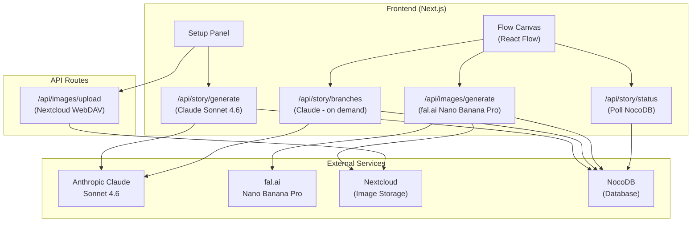
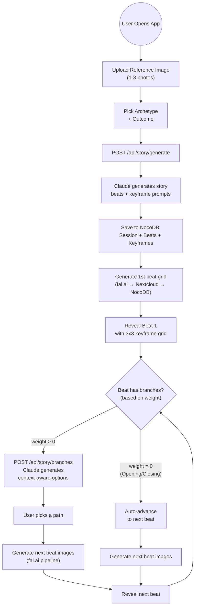
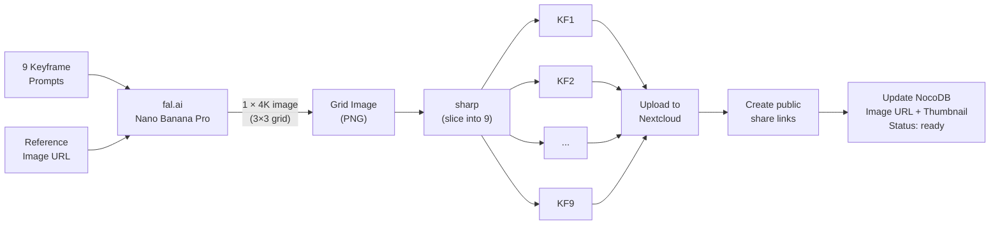
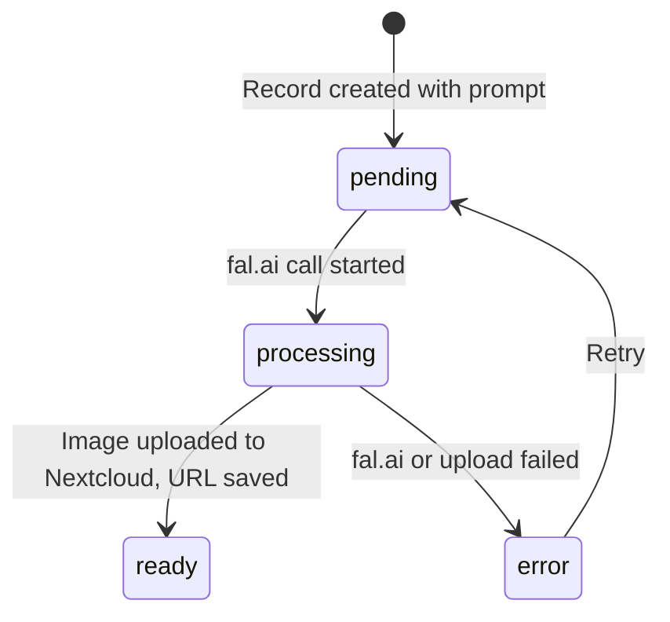

# Storyception Architecture

**Last Updated:** 2026-02-06

---

## System Overview



---

## User Flow



---

## Data Flow: Image Generation Pipeline



---

## NocoDB Tables

| Table | ID | Purpose |
|---|---|---|
| **Sessions** | `mr4ilxbt1jsqf2l` | One per story. Archetype, outcome, reference image |
| **Beats** | `may145m0gc24nmu` | Story beats with descriptions, prompts, status |
| **Branches** | `mt91qfqomry3bal` | Branch options per beat (generated on demand by Claude) |
| **Keyframes** | `mc5xw2syf1fxek8` | 9 per beat. Prompt, image URL, thumbnail, status |

### Keyframe Status Lifecycle



---

## Beat Weight System

Each beat in each archetype has a weight (0.0 - 1.0) that controls branching:

| Weight | Branch Behavior | Count |
|---|---|---|
| **0.0** | No branches (auto-advance) | 0 |
| **0.1 - 0.4** | Rare, subtle hint | 0-2 |
| **0.5 - 0.7** | Sometimes shown | 2 |
| **0.8 - 1.0** | Always shown, encouraged | 2-3 |

Weights are defined per-archetype in `lib/beat-weights.ts`.

Beats marked **loopable** (e.g. "Fun & Games", "Tests, Allies, Enemies") allow the user to explore multiple scenes before continuing.

---

## Branch Generation (On-Demand)

Branches are NOT pre-generated. When the user reaches a beat:

1. Check beat weight → decide if branches appear
2. If yes: `POST /api/story/branches` sends the story context + current beat to Claude
3. Claude generates 2-3 **context-aware** branch options that fit the narrative
4. Branch options saved to NocoDB Branches table
5. User picks one → triggers image generation for next beat

---

## Tech Stack

| Layer | Technology |
|---|---|
| Framework | Next.js 15 + React 19 |
| Package Manager | Bun |
| Styling | Tailwind CSS 4 |
| Flow Visualization | React Flow (@xyflow/react) |
| Animation | Framer Motion |
| LLM (Story) | Anthropic Claude Sonnet 4.6 |
| Image Gen | fal.ai Nano Banana Pro |
| Image Storage | Nextcloud (WebDAV + public shares) |
| Database | NocoDB (self-hosted) |
| Image Processing | sharp (grid slicing + thumbnails) |

---

## Environment Variables

```
ANTHROPIC_API_KEY      # Claude Sonnet 4.6
FAL_KEY                # fal.ai image generation
NOCODB_BASE_URL        # NocoDB instance
NOCODB_API_TOKEN       # NocoDB auth
NOCODB_TABLE_SESSIONS  # mr4ilxbt1jsqf2l
NOCODB_TABLE_BEATS     # may145m0gc24nmu
NOCODB_TABLE_BRANCHES  # mt91qfqomry3bal
NOCODB_TABLE_KEYFRAMES # mc5xw2syf1fxek8
NEXTCLOUD_BASE_URL     # Nextcloud instance
NEXTCLOUD_USERNAME     # WebDAV user
NEXTCLOUD_APP_PASSWORD # Nextcloud app password
NEXTCLOUD_UPLOAD_PATH  # /Storyception
```

---

## Key Files

```
app/
  api/
    story/generate/route.ts   # Story generation (Claude)
    story/branches/route.ts   # On-demand branch gen (Claude) [TODO]
    images/generate/route.ts  # Per-beat image pipeline [TODO]
    images/upload/route.ts    # Reference image upload to Nextcloud
  page.tsx                    # Main app page

components/storyception/
  setup-panel.tsx             # Archetype + image + outcome selection
  flow-canvas.tsx             # React Flow canvas with progressive reveal
  story-canvas.tsx            # Card view (alternative)
  nodes/
    story-beat-node.tsx       # Beat node with 3x3 grid + lightbox
    branch-node.tsx           # Branch option node

lib/
  nocodb.ts                   # NocoDB client (CRUD for all tables)
  beat-weights.ts             # Per-archetype branch weights
  story-generator.ts          # Beat percentages + local branch gen (legacy)
  types.ts                    # TypeScript interfaces
  colors.ts                   # Beat/branch color system
```
